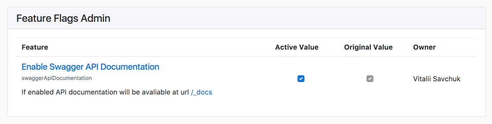

# Feature flags

Used https://github.com/FredKSchott/fflip and https://github.com/FredKSchott/fflip-express

## Usage

Ви описуєте свою фічу у файлі [config/features.json](config/features.json) у форматі:
```javascript
{
  "id": "swaggerApiDocumentation",
  "name": "Enable Swagger API Documentation",
  "description": "",
  "owner": "Vitalii Savchuk <vitalii.savchuk@eliftech.com>",
  "refLink": "https://github.com/elifTech/nodejs-boilerplate/issues/1",
  "enabled": true,
  
    // if `criteria` is in an object, ALL criteria in that set must evaluate to true to enable for user
  "criteria": {"isPaidUser": true, "percentageOfUsers": 0.50},
    
    // if `criteria` is in an array, ANY ONE set of criteria must evaluate to true to enable for user
  "criteria": [{"isPaidUser": true}, {"percentageOfUsers": 0.50}]
}
```


### Middleware

`ff.has('-- feature id --')`


## Admin


